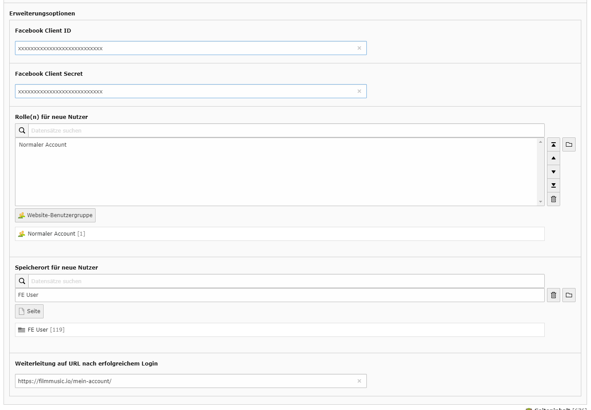
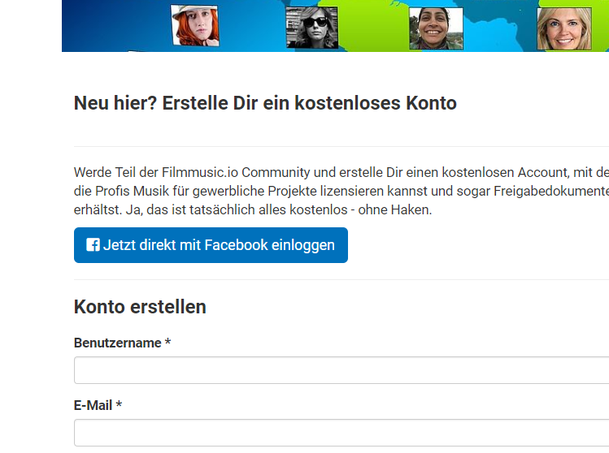
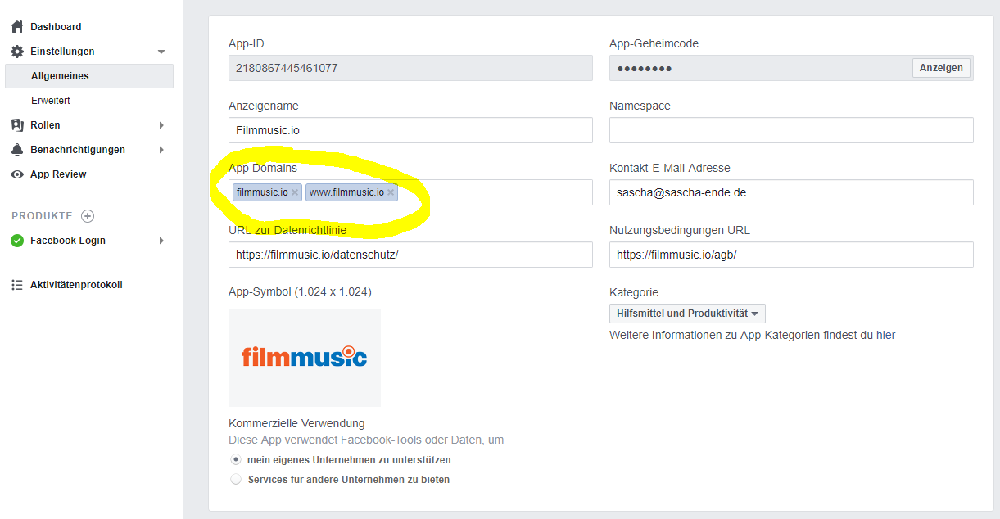
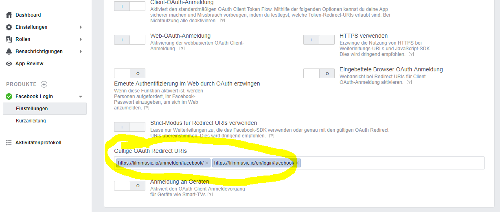

# facebooklogin - Facebook Login Plugin für TYPO3

Login mit Facebook, schnelle Einrichtung, einfacher gehts kaum :)

* **TER**: https://extensions.typo3.org/extension/facebooklogin/
* **CMS**: TYPO3 8
* **Type**: plugin

## Changelog

* **12.11.2018** - [1.1.0]  Added multiple signal slots (see documentation)
* **12.11.2018** - [1.0.1]  Icon was missing
* **12.11.2018** - [1.0.0]  First release

# So gehts

## Funktionsweise

Nutzer werden eingeloggt, insofern es eine E-Mail Adresse gibt die mit dem Facebook Account übereinstimmt.
Existiert der Nutzer nicht, wird automatisch ein FrontendUser Account mit definierbaren Rollen und einem Zufallspasswort angelegt, als Benutzername wird die E-Mail Adresse von Facebook verwendet.

## Installation

* Hier eine Facebook App anlegen: https://developers.facebook.com/apps
* Auf Facebook die App einrichten, Du benötigst in jedem Fall die "ClientID" und "ClientSecret"
* "facebooklogin" Extension installieren
* TypoScript Integration nicht notwendig, alle Einstellungen werden im Plugin selbst vorgenommen
* Eine versteckte Seite (A) "Facebook Login" (oder ähnlich) anlegen
* Plugin auf Seite (A) einfügen
* Einstellungen im Plugin vornehmen (es muss ALLES korrekt ausgefüllt werden)
* Button auf Seite (B) - also eine andere Seite - einbauen und auf Facebook Login Seite (A) verlinken (siehe unten)

### Plugin auf Seite (A) 



### Verlinkung auf Seite (B) 



## Wichtige Anmerkungen zur Einrichtung der Facebook App

Es ist wichtig, die Domain und Redirect URI richtig anzugeben, damit der Login funktioniert. Das ganze startet man am besten, indem man als Funktion bei Facbeook "Facebook Login" auswählt.





## Auf Anmeldeseite Button einbauen

Hier ein Beispiel

```
<a href="/anmelden/facebook" class="btn btn-primary btn-lg"><i class="fab fa-facebook-square"></i> Jetzt direkt mit Facebook einloggen</a>
```

oder mit Fluid:

```
<f:link pageUid="122" class="btn btn-primary btn-lg"><i class="fab fa-facebook-square"></i> Jetzt direkt mit Facebook einloggen</f:link>
```

## Demo

Hier: https://filmmusic.io/anmelden/

## Verfügbare Signal Slots

| Klasse                                              | Signal                    | Parameter               |
|-----------------------------------------------------|---------------------------|-------------------------|
| SaschaEnde\Facebooklogin\Controller\LoginController | beforeRedirectToFacebook  | $fb, $this              |
| SaschaEnde\Facebooklogin\Controller\LoginController | afterRedirectFromFacebook | $fb, $userdata, $this   |
| SaschaEnde\Facebooklogin\Controller\LoginController | userLogin                 | $user, $this            |
| SaschaEnde\Facebooklogin\Controller\LoginController | error                     | $userdata, $this        |
| SaschaEnde\Facebooklogin\Controller\LoginController | newUserAdded              | $user, $password, $this |
